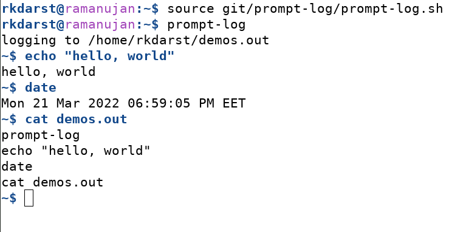

# Pretty prompt and logging for demos

A "show the recent prompt history for use in demos and teaching".  It
has some features not found in all similar tools:

- Show the command in the history before it exits.  For long running
  commands like those that open the editor, watchers need to see the
  command before it returns back to the shell.
- Also adjust the prompt appearance and color.
- Color the **command being typed** in addition to the prompt itself.
- Updates the window title bar with the machine name and the working
  directory (saving space in the prompt itself).
- Logs to a separate file.  Recommended to open another terminal (with
  a smaller font size) to `tail -f demos.out`.
- Compatible with bash/zsh.  Simple, pure shell.
- Compatible with fish (`source prompt-log.fish` instead)




## Installation

Clone the repository, or copy `prompt-log.sh` locally.

`source prompt-log.sh` (this could even be within your shell startup
scripts - the source-ing alone does not change anything).

### One more step on macOS

To run *prompt-log* on macOS, we need to install two additional packages that
provide macOS with some GNU/Linux functionality. To do this you can use
[Homebrew](https://brew.sh) and install `coreutils` and the `watch` command:

```
brew install coreutils watch
```

> **Background:** *prompt-log* uses `readlink` to get the absolute path of the
> output file before it is actually written (cf. *Usage*). On macOS, we need to
> get around the fact that its native version of `readlink` needs the file to
> exist and also uses different command-line options. *prompt-log* will check
> your operation system and will choose to use `greadlink` on macOS instead of
> `readlink`.


## Usage

1. Run the shell alias `prompt-log [file]` to start the logging
(this permanently changes the shell prompt and so on).  Logs are written
to `~/demos.out` if `[file]` is not given.

2. Make sure to type at least one command, so the file gets created.

3. Open a different terminal window and use `watch` to monitor the contents of
   `[file]`.

    ```
    watch tail [file]
    ```


## Status and development

Under semi-active development, but you might expect to have to modify
the source to work on other computers.  Please contribute.


## See also

- https://coderefinery.org/manuals/instructor-tech-setup/
  lists more things to do for a clear screenshare and lists some other
  options for history logging.
